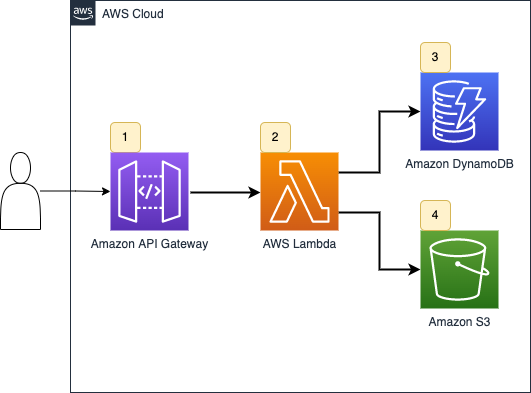

# AWS Lambda - Unit Test Example

## Project Architecture

The project consists of an Amazon API Gateway, an AWS Lambda function, a DynamoDB Table, and an S3 bucket.  Although this project can be deployed, the focus of the code is to demonstrate unit testing approaches using Python.



An API Gatway path [1] triggers an AWS Lambda function [2] that retrieves a data from a DynamoDB [3] table and writes data to a object on Amazon S3 [4].  The API path contains a Document Type and a Customer ID.  The Lambda function retrieves both the Document Type data and Customer ID data and combines them, writing the data to S3 and returning the object key [1].  The DynamoDB table name and the S3 bucket name are provided to the Lambda function via environment variables.  

The DynamoDB table schema is comprised of a Partition Key (PK) for looking up a given item, and a “data” field containing string contents.  Document Type Items are prefixed with D#, and Customer items have a PK prefixed with C#.

---
## Code Note:
The code in this project is simplified - we’ve opted for concise snippets over fully completed or PEP8 compliant production code.

---
## Prerequisites:
* [AWS CLI](https://docs.aws.amazon.com/cli/latest/userguide/getting-started-install.html)
* [AWS Serverless Application Model (SAM) CLI](https://docs.aws.amazon.com/serverless-application-model/latest/developerguide/serverless-sam-cli-install.html)
* [Python 3.9](https://www.python.org/downloads/)
* [Make build utility](https://www.gnu.org/software/make/)

---
## Make commands
The project Makefile contains helper commands for working with the project:
* ```make createEnv```: Create a Python Virtual Envionment and install dependencies
* ```make unittest```: Run a unit test, guarding for socket connections
* ```make coverage```: Run unit tests and provide a coverage report
* ```make deploy```: Deploy the stack to an AWS Account

---
## Running the project
* To deploy the project, deploy the project using the ```make deploy``` command.
* Once deployed, locate the DynamoDB Table created and add two records:
  * ```{ "PK" : "C#TestCustomer", "data" : "Testing Customer"}```
  * ```{ "PK" : "D#Welcome", "data" : "\nHello and Welcome!\n"}```
* As authentication is not configured, you can test the endpoint using the API Gateway service in the AWs Console:
*  ```https://{region}.console.aws.amazon.com/apigateway```  

---
## Project Structure

```
.
├── Makefile                          # Sample project commands
├── README.md                         # This file
├── doc                            
│   └── architecture.png              # README images
├── src
│   └── sampleLambda
│       ├── app.py                    # Example AWS Lambda Handler
│       ├── schemas.py                # Lambda Event and response schema definitions 
│       └── requirements.txt          # Lambda python requirements
├── template.yaml                     # SAM Deployment Script
└── tests
    ├── requirements.txt              # Unit test python requirements
    ├── events                        
    │   └── SampleEvent1.json         # Sample Events for Testing
    └── unit
        └── src
            └── test_sampleLambda.py  # Unit test - Lambda Handler

```

## License

Copyright Amazon.com, Inc. or its affiliates. All Rights Reserved.

Permission is hereby granted, free of charge, to any person obtaining a copy of this
software and associated documentation files (the "Software"), to deal in the Software
without restriction, including without limitation the rights to use, copy, modify,
merge, publish, distribute, sublicense, and/or sell copies of the Software, and to
permit persons to whom the Software is furnished to do so.

THE SOFTWARE IS PROVIDED "AS IS", WITHOUT WARRANTY OF ANY KIND, EXPRESS OR IMPLIED,
INCLUDING BUT NOT LIMITED TO THE WARRANTIES OF MERCHANTABILITY, FITNESS FOR A
PARTICULAR PURPOSE AND NONINFRINGEMENT. IN NO EVENT SHALL THE AUTHORS OR COPYRIGHT
HOLDERS BE LIABLE FOR ANY CLAIM, DAMAGES OR OTHER LIABILITY, WHETHER IN AN ACTION
OF CONTRACT, TORT OR OTHERWISE, ARISING FROM, OUT OF OR IN CONNECTION WITH THE
SOFTWARE OR THE USE OR OTHER DEALINGS IN THE SOFTWARE.